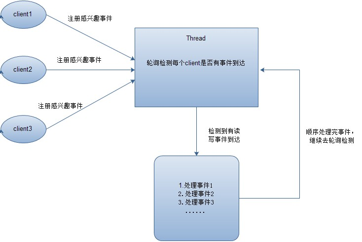

# JVM
* what: Java Virtual Machine;是操作系统与应用程序的中间层；
* why: 想要一种一次编译，随处运行的跨平台编程语言；C/C++中指针和内存管理很麻烦，希望可以应用程序自己管理内存的申请和释放；
* how: 通过vm虚拟操作指令的方式，屏蔽应用程序直接与操作系统间的交互；通过字节码技术让应用程序代码可以运行在任意平台的jvm上；通过GC机制来让jvm管理应用进程的内存申请和释放；

# NIO

* what: Non-Blocking I/O 非阻塞式IO
* why: 在IO密集型的应用中CPU常处于空转等待IO的状态，无法处理新的IO请求，造成资源浪费
* how:多线程异步、Reactor模式；select/epoll调度算法

在Java中用多线程技术实现NIO，其中针对网络IO可以使用netty框架

多线程IO模式

Reactor IO模式

# 并发编程

* what: 让CPU在同时间内处理多个程序任务
* why: CPU单核算力达到瓶颈，发展为多核CPU，为了让应用程序充分利用多核CPU资源
* how: Java多线程技术

# Spring开发框架

* what: Spring是一款轻量级的Java应用开发框架，主要提供IOC和AOP的功能
* why: Java应用开发标准不统一，组件多种类杂；开发出来的应用代码臃肿、耦合度高；
* how: 使用IOC技术让spring容器来管理对象的实例化，减少的对象依赖；通过spring-aop提供面向切面编程的能力，降低代码耦合程度；通过bean配置和接口定义统一的外部组件实现标准，让对接外部服务变得简单；

Spring IOC流程

Spring-AOP原理：

动态代理：

JDK Proxy: 切点为接口时, 创建Proxy对象

CGLib: 切点为一般类时，字节码增强，实现子类

# MySQL数据库

* what：数据持久化的存储服务，记录现实世界中某一时刻某个对象的状态；
* why:应用程序操作文件系统十分的复杂；
* how:使用SQL来操作数据；

数据库事务：

- 原子性： 通过undo log实现，保证一次事务要么都成功，要么都失败；
- 隔离性：引入隔离级别概念，使用锁机制和MVCC机制保证事务之间的交叉范围；
- 持久性：redo log等wal技术实现数据库的故障恢复等机制，保证事务提交成功后结果永远存在；
- 一致性：通过原子性、隔离性、持久性和业务逻辑的控制保证数据一致性；

# 分布式系统

* what:分布式系统是若干独立计算机的集合，这计算机对用户来说就像单个相关系统。 -- 《分布式系统原理与范型》
* why:单机/集中式系统无法承载住如今巨大的用户量带来的系统的性能压力；
* how:运用分层架构、领域驱动设计等设计思想和方法论对系统需求进行水平和垂直方向的拆分，采用多服务协调的方式提供服务，分摊系统性能压力；

